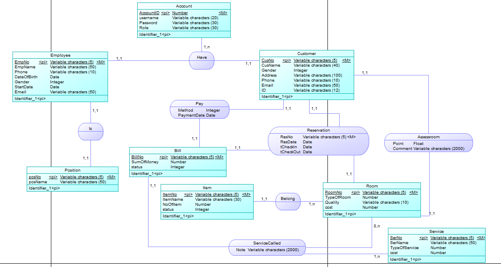

#                     java_IS216.M21_7 

**Đồ án môn Lập trình Java - IS216.M21 nhóm 7**  
**ĐỀ TÀI: HỆ THỐNG QUẢN LÝ KHÁCH SẠN**
#
- [Khám phá ](https://github.com/mynhung2010/java_IS216.M21_7)
- [Báo lỗi](https://github.com/mynhung2010/java_IS216.M21_7/issues)
- [Các yêu cầu](https://github.com/mynhung2010/java_IS216.M21_7/pulls)

## I. Mục Tiêu Để Tài
- Mô hình thực thể mối kết hợp  

Đây là project của môn lập trình java. Nội dung tạo một trang web quản lý khách sạn.  

Trang web phải đảm bảo các mục tiêu :
- giúp quản lý thực hiện được các chức năng cần thiết
- khách hàng có thể đặt phòng và các dịch vụ một cách dễ dàng
- giao diện đơn giản, dễ thực hiện

## II. Giới thiệu thành viên
| STT | Họ Tên               | MSSV     | Ghi chú |
| --- | -------------------- | -------- | ------- |
| 1   | Trần Thị Mỹ Nhung    | 20520267 |         |
| 2   | Nguyễn Thị Thảo Hồng | 20520192 |         |
| 3   | Nguyễn Thành Phát    | 20520270 |         |
| 4   | Vũ Tiến Linh         | 19521760 |         |
  
## III. Các phần mền sử dụng
Trang web được xây dựng bởi các thư viện, phần mềm hiện đại  
- IDE: [NetBeans](https://netbeans.apache.org/)
- programming language: [Java](https://www.java.com/en/)
- API: [JDBC](https://www.oracle.com/database/technologies/appdev/jdbc-downloads.html)
- Database:[Oracle](https://www.oracle.com/index.html),[SQLDeveloper](https://www.oracle.com/database/technologies/appdev/sqldeveloper-landing.html)
- Report:[Ireport](https://community.jaspersoft.com/)
## IV. Giới thiệu đề tài
Đề tài "Hệ thống quản lý khách sạn" được xây dựng nhằm phục vụ người dùng thuận lợi trong việc quản lý thông tin khách sạn và các quy trình
trong đặt và sử dụng phòng tại khách sạn. Hệ thống được xây dựng dựa trên các người dùng và chức năng chính như sau:
- Các chức năng chung:
  + Đăng nhập
  + Đăng xuất
  + Xem thông tin cá nhân
  + Xem thông tin tài khoản
  + Tra cứu
### 1. Nhân viên
  - Xem thông tin khách đặt phòng
  - Quản lý hóa đơn:
    + Xem thông tin hóa đơn
    + Cập nhật tiền cho các hóa đơn
    + Thanh toán
    + Xuất hóa đơn
  - Xem thông tin dịch vụ
  - Quản lý các dịch vụ đã đặt:
    + Thêm dịch vụ cho khách sạn
    + Sửa chi tiết dịch vụ
  - Quản lý thông tin khách hàng:
    + Xóa thông tin khách hàng
    + Sửa thông tin khách hàng
### 2. Nhân viên quản lý
  - Quản lý thông tin phòng
    + Thêm thông tin phòng
    + Xóa thông tin phòng
    + Sửa thông tin phòng
  - Quản lý thông tin vật dụng
    + Thêm thông tin vật dụng
    + Xóa thông tin vật dụng
    + Sửa thông tin vật dụng
  - Quản lý thông tin nhân viên
    + Thêm thông tin nhân viên
    + Xóa thông tin nhân viên
    + Sửa thông tin nhân viên
    + Thêm tài khoản cho nhân viên
  - Quản lý thông tin chức vụ
    + Thêm thông tin chức vụ
    + Xóa thông tin chức vụ
    + Sửa thông tin chức vụ
  - Quản lý thông tin dịch vụ
    + Thêm thông tin dịch vụ
    + Xóa thông tin dịch vụ
    + Sửa thông tin dịch vụ
  - Quản lý thông tin tài khoản
    + Xóa thông tin tài khoản
    + Sửa thông tin tài khoản
### 3. Khách hàng
  - Đặt phòng
  - Đặt dịch vụ
  - Tra cứu phòng trống
  - Thanh toán
## V.Yêu cầu hệ thống
- NetBeans 12.0
- Oracle 19c
## VI. Setup môi trường
  1.  Tải và cài đặt Netbeans: 7.0 trở lên
      - link tải [Netbeans](https://netbeans.apache.org/download/index.html)
  3.  Tải và cài đặt Oracle:19c trở lên. 
       - link tải  [Oracle](https://www.oracle.com/database/technologies/oracle-database-software-downloads.html#19c)
  4.  Tải và cài đặt SQLDeveloper: 19 tro len. 
       - link tải    [SQLDeveloper](https://www.oracle.com/database/technologies/appdev/sqldeveloper-landing.html)
  5.  Tải và cài đặt Ireport:5.0 tro len
      - link tải [Ireport](https://community.jaspersoft.com/project/ireport-designer/releases)
  6.  Tải và cài đặt JDBC và các thư viện liên quan. 
       - link tải  [JDBC](https://drive.google.com/drive/u/0/folders/1G9nYOTyClAx9VtyWUyW726IM2NnF_sBu) tải hết các file.jar
## VII. Khởi động dự án
1.  Clone dự án về máy
2.  Thêm các file .jar vào dự án
    - Vào `Libraries` chọn `ADD jar/folder` 
    - Thêm những file jar vừa tải ở trên
3.  migration database [HotelManagementSystem_Data.sql](https://github.com/mynhung2010/java_IS216.M21_7/blob/Th%C3%A0nh-Ph%C3%A1t/Oracle/Script/HotelManagementSystem_Data.sql)
     - tạo  database với `hostName`,`sid`,`userName`,`password`
     - Tải file `ConnectionOracle` chỉnh `hostName`,`sid`,`userName`,`password` theo database vừa tạo 
     - Run file `ConnectionUtils` xuất `Done!` là thành công
4.  run file `DangNhapFrame` sẽ mở ra trang web của dự án
## VIII. Liên Hệ
Trần Thị Mỹ Nhung   
Email: [Nhung](mail.google.com)  
Link dự án [HỆ THỐNG QUẢN LÝ KHÁCH SẠN](https://github.com/mynhung2010/java_IS216.M21_7)
##  IX.Tài liệu tham khảo
- [Java Tutorial](https://docs.oracle.com/javase/tutorial/)
- [https://www.oracletutorial.com/](https://www.oracletutorial.com/)
  

